# 🛍️ Stylish

Stylish is a **shopping app prototype** built with **Flutter & Dart**.  
The app was implemented based on a **Figma design**, turning visual mockups into a functional Flutter application.  
This project is a hands-on learning experience in mobile app development, focusing on **UI design, navigation, cart functionality, wishlist, and form validation** using **dummy data**.  

> ⚠️ Note: This is an early prototype. There is **no backend integration or payment gateway** yet.

---

## ✨ Features

- **Clean & Responsive UI**: Designed to match the Figma mockup, with product cards, grid view, and smooth navigation.  
- **Dummy Product Data**: Simulates a real shopping app experience.  
- **Cart System**: Add/remove items, view total price.  
- **Wishlist**: Save favorite products for later.  
- **Form Validation**: Ensures correct input in forms.  
- **Navigation Flow**: SplashScreen → OnboardingScreen → Signin → getStarted → HomeScreen → _buildGridView → Shoppage → Checkout → Placeorder → PaymentScreen → HomeScreen
-  **Navigating with Data**: Ensures Passing data from one page to another in Flutter.  


---

## 🚫 Limitations / Not Yet Implemented

- No backend integration (all data is local/dummy).  
- No payment gateway (checkout is simulated).  

---

## 🧑‍💻 What I Learned

- Translating Figma designs into Flutter UIs.  
- Creating responsive layouts using Flutter widgets.  
- Navigating between multiple screens.  
- Implementing validation for forms.  
- Designing a shopping app prototype workflow.  

---

## 📂 Project Structure
stylish/

├── android/              # Android-specific code  
├── ios/                  # iOS-specific code  
├── linux/                # Linux build support  
├── macos/                # macOS build support  
├── web/                  # Web build support  
├── windows/              # Windows build support  
├── assets/images/        # Images and other asset files  
├── lib/                  # Main Flutter source code  
├── test/                 # Unit and widget tests  
├── .gitignore            # Git ignore rules  
├── .metadata             # Flutter project metadata  
├── analysis_options.yaml # Linter and analysis settings  
└── pubspec.yaml          # Flutter dependencies  

 
 ## 🚀 Getting Started

Clone the repository:
```bash
git clone https://github.com/FaysArukatil/stylish.git
cd stylish
flutter pub get
flutter run
```
```markdown
```markdown
## 📸 Screenshots

### Cover & Design
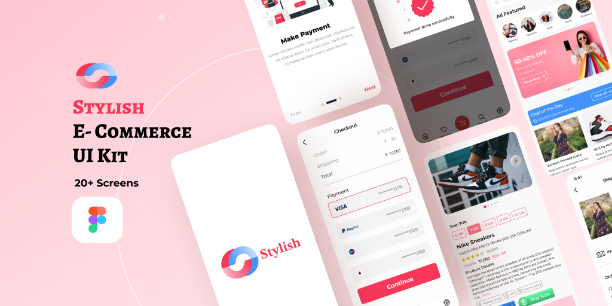{ width=250 }
{ width=250 }

### Splash & Onboarding
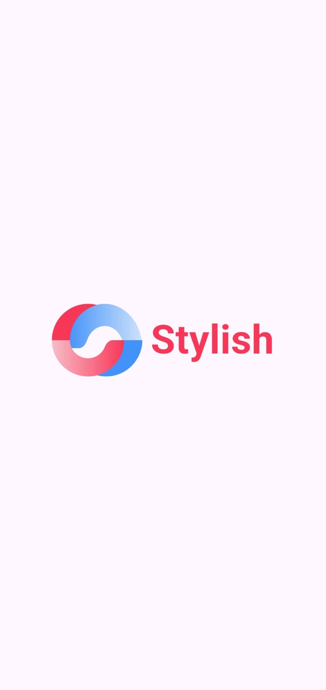{ width=250 }
{ width=250 }
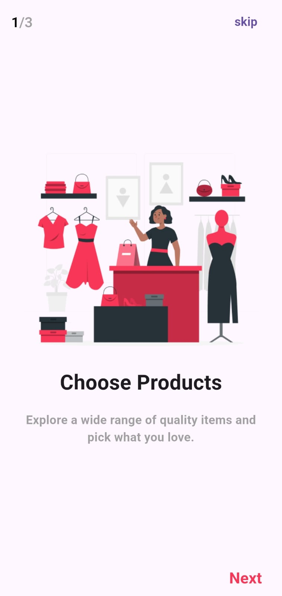{ width=250 }
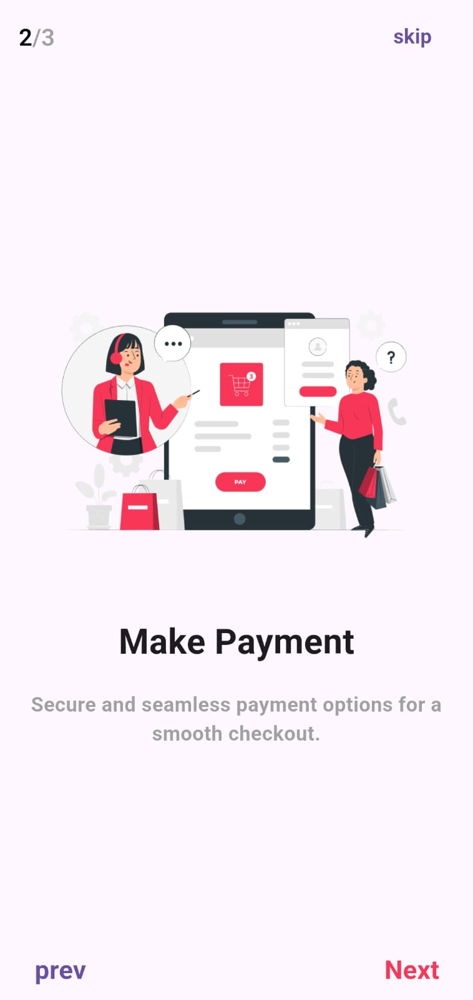{ width=250 }
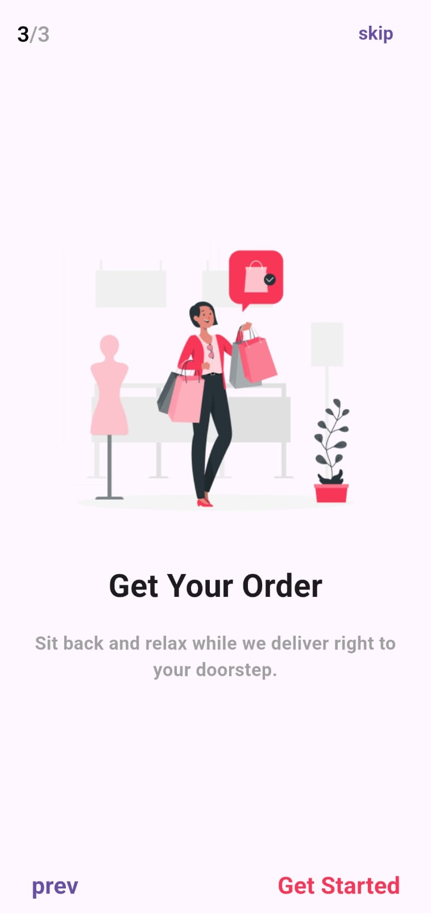{ width=250 }

### Authentication
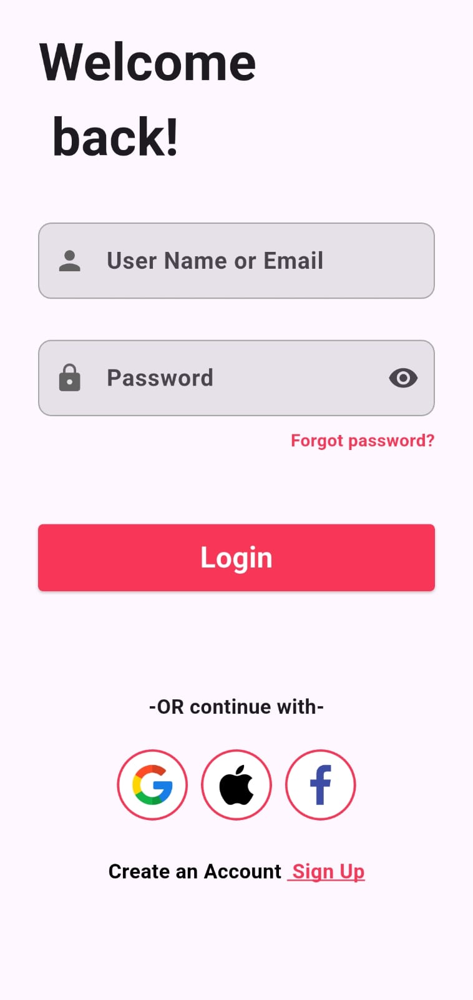{ width=250 }
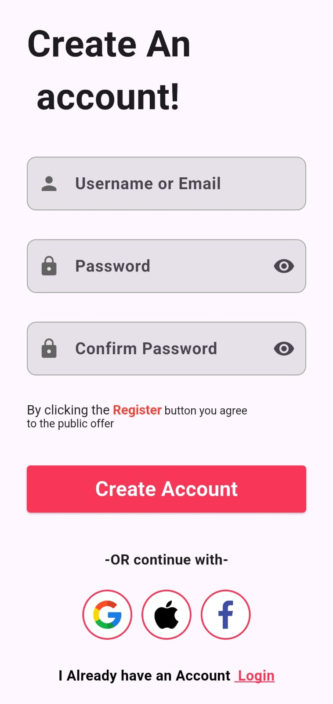{ width=250 }
{ width=250 }

### Home & Product
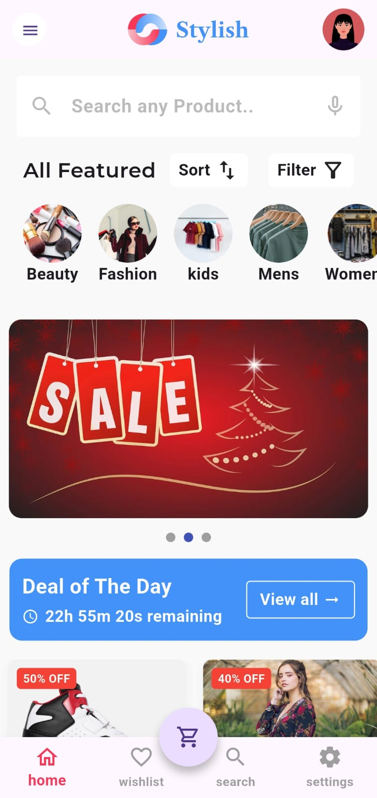{ width=250 }
{ width=250 }
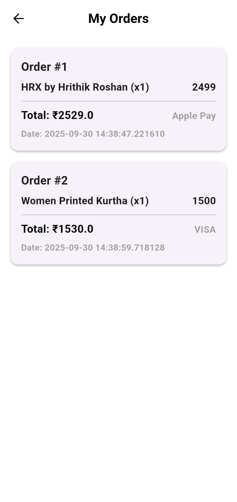{ width=250 }
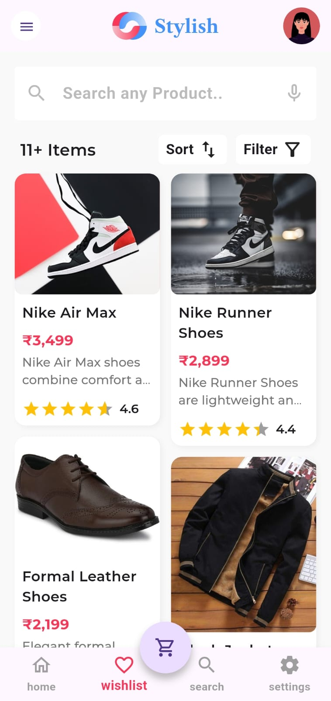{ width=250 }

### Search & Settings
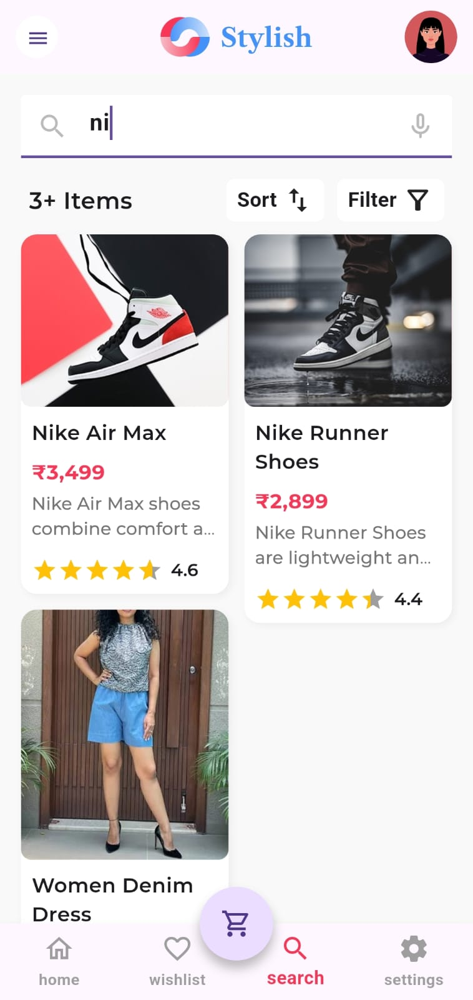{ width=250 }
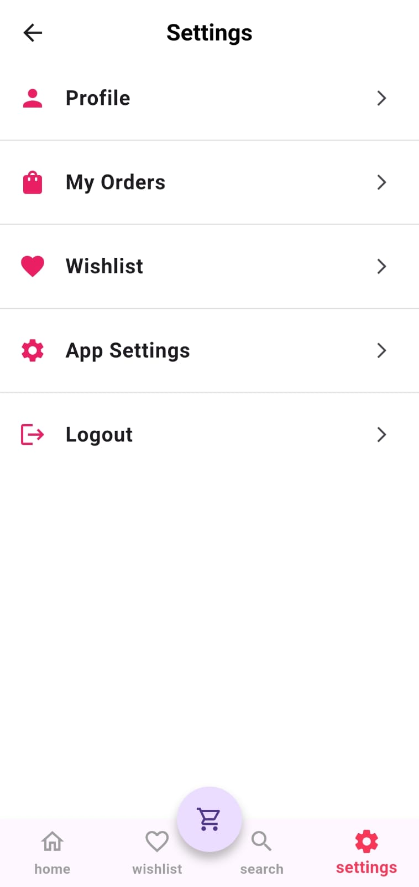{ width=250 }
```

## 🤝 Contributing

Feedback and suggestions are welcome!  

- Fork the repository  
- Open issues for bugs or improvements  
- Submit pull requests


## 📜 License

This project is open-source.


## 🔗 Connect with Me

**👤 Fays Arukattil**  
[LinkedIn](https://www.linkedin.com/in/faysarukattil) | [GitHub](https://github.com/FaysArukattil)


